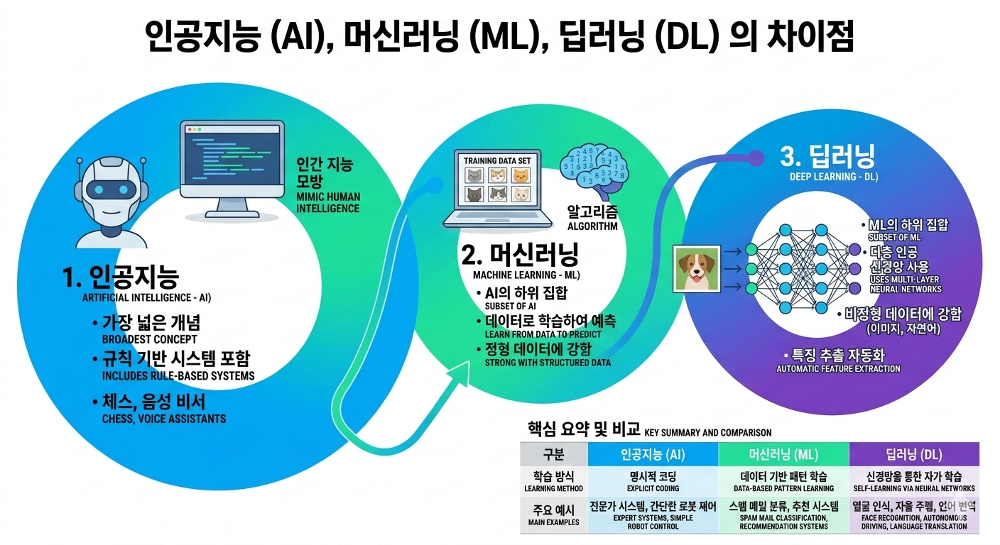

# AI / ML / DL

<figure><figcaption></figcaption></figure>

### 인공지능, 머신러닝, 딥러닝: 무엇이 다를까요?

최근 뉴스나 인터넷에서 'AI', '인공지능', '딥러닝' 같은 단어들을 정말 자주 접하시죠? 이 세 단어는 종종 혼용되어 사용되지만, 엄밀히 말하면 서로 다른 개념이며 포함 관계를 가지고 있습니다. 가장 쉽게 이해하는 방법은 **'러시아 인형(마트료시카)'**&#xC744; 떠올리는 것입니다. 가장 큰 인형 안에 중간 크기 인형이 있고, 그 안에 또 가장 작은 인형이 들어있는 구조와 같습니다.

#### 1. 인공지능 (AI: Artificial Intelligence) - 가장 큰 인형

인공지능은 가장 넓은 개념으로, **'인간의 지능을 기계로 구현하려는 모든 기술'**&#xC744; 의미합니다. 마치 기계가 사람처럼 생각하고, 판단하고, 문제를 해결하도록 만드는 것이 최종 목표입니다.

* 특징: 컴퓨터가 스스로 학습하든, 사람이 모든 규칙을 미리 입력해 주든 관계없이, 기계가 지능적인 행동을 보인다면 모두 AI에 해당합니다.
* 예시:
* 고전적인 AI: 체스 게임 프로그램처럼 모든 경우의 수를 사람이 프로그래밍하여 컴퓨터가 판단하게 만드는 것.
* 현대의 AI: 우리가 흔히 보는 스마트폰 음성 비서(시리, 빅스비), 자율주행 자동차 등.

#### 2. 머신러닝 (ML: Machine Learning) - 중간 인형

머신러닝은 AI의 한 분야로, **'기계가 스스로 데이터를 학습하여 성능을 향상시키는 기술'**&#xC744; 의미합니다. 과거처럼 사람이 모든 규칙을 일일이 컴퓨터에게 알려주는 것이 아니라, 컴퓨터에게 수많은 데이터를 보여주고 컴퓨터 스스로 그 안에서 규칙과 패턴을 찾아내게 만드는 방식입니다.

* 특징: 데이터가 핵심입니다. 좋은 데이터를 많이 학습할수록 컴퓨터의 예측이나 판단 능력이 좋아집니다. '학습(Training)'이라는 과정이 필요합니다.
* 예시:
* 스팸 메일 분류: 수만 통의 스팸 메일과 일반 메일 데이터를 컴퓨터에게 학습시키면, 컴퓨터는 스팸 메일에서 자주 나타나는 단어나 패턴을 스스로 파악하여 새로운 메일이 왔을 때 스팸인지 아닌지 분류할 수 있게 됩니다.
* 넷플릭스/유튜브 추천 시스템: 사용자가 시청한 영상 데이터를 기반으로 취향을 학습하여 좋아할 만한 영상을 추천합니다.

#### 3. 딥러닝 (DL: Deep Learning) - 가장 작은 인형

딥러닝은 머신러닝의 수많은 방법 중 하나로, **'인간의 뇌 구조(신경망)를 모방하여 학습하는 기술'**&#xC744; 의미합니다. 머신러닝 중에서도 특히 복잡하고 대량의 데이터를 처리하는 데 뛰어난 성능을 보입니다.

* 특징: '인공 신경망(Artificial Neural Networks)'이라는 구조를 사용합니다. 이 신경망이 여러 층(Deep)으로 겹쳐져 있어서 '딥러닝'이라고 부릅니다. 사진, 영상, 음성 같은 비정형 데이터를 처리하는 데 매우 강력합니다.
* 예시:
* 이미지 인식: 수십만 장의 개와 고양이 사진을 학습시켜, 새로운 사진을 보았을 때 그것이 개인지 고양이인지 정확하게 구별해 냅니다. 자율주행 자동차가 보행자나 표지판을 인식하는 것도 딥러닝 기술 덕분입니다.
* 언어 번역: 파파고나 구글 번역기처럼 문장의 맥락을 파악하여 자연스러운 번역을 가능하게 합니다.

핵심 요약

<table><thead><tr><th width="162.5">구분</th><th>인공지능 (AI)</th><th>머신러닝 (ML)</th><th>딥러닝 (DL)</th></tr></thead><tbody><tr><td>정의</td><td>인간의 지능을 기계로 구현하는 모든 기술</td><td>데이터를 통해 기계가 스스로 학습하는 기술</td><td>인간의 뇌 신경망을 모방하여 학습하는 머신러닝 기술</td></tr><tr><td>관계</td><td>가장 상위 개념 (가장 큰 인형)</td><td>AI의 하위 집합 (중간 인형)</td><td>ML의 하위 집합 (가장 작은 인형)</td></tr><tr><td>작동 방식</td><td>규칙 기반부터 학습 기반까지 다양</td><td>데이터를 통한 패턴 학습</td><td>다층 인공 신경망을 통한 학습</td></tr><tr><td>핵심 요소</td><td>지능적인 행동 구현</td><td>데이터, 알고리즘</td><td>대량의 데이터, 높은 컴퓨팅 파워, 인공 신경망</td></tr><tr><td>주요 예시</td><td>음성 비서, 체스 프로그램, 자율주행</td><td>스팸 메일 분류, 추천 시스템, 매출 예측</td><td>이미지/음성 인식, 자연어 처리, 자율주행</td></tr></tbody></table>

이제 AI, 머신러닝, 딥러닝의 차이가 조금 느껴지시나요? 딥러닝은 머신러닝의 일종이고, 머신러닝은 인공지능의 일종이라는 것을 기억하시면 됩니다!

