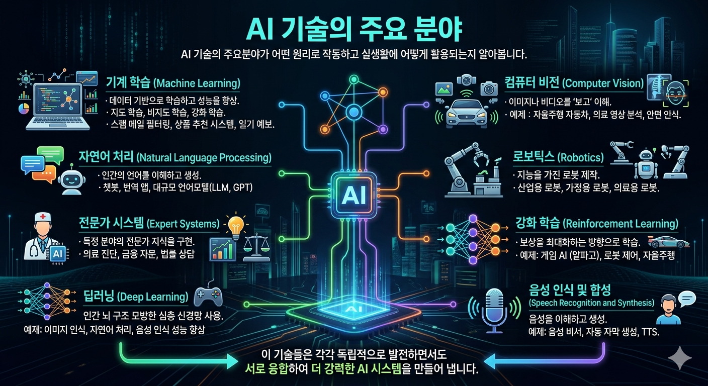

# Part 2. 누구나 쉽게 이해하는 인공지는 기술

AI 리터러시의 핵심 영역 중 우리가 아직 알지 못하는 것이 남아 있지요? 바로 AI와 데이터 이입니다. 이 영역의 중요성은 외국어를 배울 때의 문법을 생각해 보면 이해하기 쉽습니다. 문법만으로는 언어를 유창하게살구사할 수 없지만, 언어를 정확히 이해하고 올바르게 사용하기 위해서는 필수적입니다. 마찬가지로 AI 기술의 원리나 작동 방식을 이해한다면, AI를 더 효과적으로 활용하고 그 한계와 가능성을 정확히 파악하는 데 도움이 됩니다.

### 01. 일상 속 알기 쉬운 예시로 AI 리터러시 Up

#### 당신의 취향을 아는 AI, 넷플릭스/유튜브의 추천 알고리즘

넷플릭스에서 영화나 드라마를 찾다 보면, 취향에 딱 맞는 작품들이 추천디는 것을 경험해 본 적이 있을 겁니다. 이 놀라운 기능은 바로 AI 기술, 그 중에서도 **‘추천 알고리즘’** 덕분입니다. 넷플릭스는 우리가 본 영화, 평가, 검색 기록 등을 꼼꼼하게 분석하여 우리의 취향을 파악하고, 그에 맞는 여러 작품들을 추천해 줍니다.

추천 알고리즘에는 여러가지가 있지만, 그중 가장 기본이 되는 2가지를 살펴보겠습니다.

* 콘텐츠 기반 필터링(Content-based Filtering)
  * 이 방식은 내가 좋아하는 작품과 비슷한 특징을 가진 작품을 추천하는 방식입니다.
  * 이 방식은 내가 이미 좋아하는 것과 비슷한 작품만 추천하기 때문에, 새로운 장르나 을향을 발견하기다어렵다는 한계가 있습니다.
* 협업 필터링(collaborative Filtering)
  * 나와 비슷한 취향을 가진 다른 사용자들이 좋아하는 작품을 추천하는 방식입니다.
  * 이 경우는 사용자 데이터가 충분하지 않을 때에는 추천 정확도가 떨어지게 된다는 한계점도 있습니다.

<figure><figcaption></figcaption></figure>

#### 늘 최적 경로를 아는 AI, 내비게이션 알고리즘

티맵, 카카오맵과 같은 내비게이션 앱은 단순히 지도 정보만 제공하는 것이 아닙니다. AI 기술을 활용하여 실시간 교통 정보를 분석하고, 최적의 경로를 계산하며, 심지어 예상 도착 시간까지 예측합니다.

* 실시간 데이터 수집
  * AI는 교통 체증, 사고, 도로 공사 등 교통 데이터를 바로 분석하여, 사용자가 가려는 길이 막히지 않았는디, 더 빠른 우회로가 있는지를 계산하게 됩니다.
* 경로 최적화 알고리즘
  * 내비게이션은 단순히 가장 짧은 경로를 제공하는 것이 아니라, 여러 요소를 고려하여 사용자가 가장 편하게 이동할 수 있는 경로를 찾습니다. AI는 도로의 제한 속도, 교차로의 신호 시간, 주변 교통 흐름, 통행료 등을 분석하여 최적의 경로를 계산합니다.
* 예측 알고리즘
  * AI는 과거의 교통 데이터를 분석하여 특정 시간대나 요일에 어떤 도로가 막힐지 예측합니다.

<figure><figcaption></figcaption></figure> <figure><figcaption></figcaption></figure>

#### 나를 업그레이드하는 AI, 스우노(SNOW)의 얼굴 인식

필터 카메라 앱의 대표격인 ‘스노우’는 우리 얼굴의 특징을 정확하게 파악하고, 다양한 필터 효과를 적용하여 새로운 이미지를 만들어 냅니다.

* 얼굴 인식(Facial Recognition)
  * 사진 속 얼굴을 정확하게 인식하고, 눈, 코, 입 등 주요 부위의 위치와 크기를 파악할 수 있는 기술입니다. 얼굴과 주요 부위를 정확하게 인식하여, 콧수염을 그려주거나 볼터치를 해주는 등 다양한 변신을 시켜줄 수 있는 것은 모두 AI 덕분이죠.
* 얼굴 변형(Face Transfomation)
  * 얼굴 인식 기술만으로 스노우의 마법 같은 변신 효과를 구현할 수는 없습니다. 핵심은 바로 얼굴 변형 기술입니다. 얼굴 변형 기술의 적용 과정은 마치 퍼즐을 맞추는 것과 비슷합니다.

<figure><figcaption></figcaption></figure> <figure><figcaption></figcaption></figure>

#### 당신의 말에 귀 기울이는 AI, 인공지능 비서의 원리

Hey, Siri\~, Ok Google\~. 대부분의 스마트폰에는 AI 비서가 내장되어 있습니다. 그 안에 있는 기술들을 살펴봅니다.

* \[1단계] 음성 인식 (Speech Recognition)
  * 우리의 말소리를 컴퓨터가 이해할 수 있는 텍스트로 바꿔야 합니다. 말소리를 정확히 인식해야 하기 때문에, AI는 수많은 사람의 목소리를 들으며 다양한 발음과 억양을 학습합니다. 이 과정에서 단순히 소리를 텍스트로 바꾸는 것뿐만 아니라, 배경 소음을 걸러내고 여러 사람의 목소리를 구분하는 능력도 갖추게 됩니다.
* \[2단계] 자연어 처리 (Natural Language Processing, NLP)
  * AI가 우리의 말뜻을 이해하기 위해 사용하는 기술입니다. 문맥을 이해하고 중의적인 표현도 파악할 수 있습니다.
* \[3단계] 대화 관리 (Dialogue Management)
  * AI가 사용자와의 대화를 자연스럽게 이어가는데 핵심적인 역할을 하는데, 크게 3가지 요소(대화 맥락 이래, 정보 검색, 응답 생성)로 구성됩니다.
* \[4단계] 음성 합성 (Speech Synthesis)
  * 준비된 답변을 다시 음성으로 변환해 사용자에게 돌려주어야 하는데 사용되는 기술입니다. 아직 사람처럼 완벽하지는 않지만 사람이 말하는 것 같은 자연스러운 목소리를 만들어 내는 기술 수준까지 올라왔습니다.

<figure><figcaption></figcaption></figure>

#### 나 대신 운전하는 AI, 자율주행 시대가 온다다

자율주행차는 AI를 통해 인지하고, 판단하고, 제어하는 과정을 통해 안전하고 편리한 이동을 가능하게 합니다.

*   \[1단계] 인지: 자율주행차의 ‘눈과 귀’

    * 자율주행 자동차가 주변환경을 인식하는 과정입니다. 이 단계에서 자동차는 카메라, 레이더, 라이다(LiDAR), GPS 등의 센서를 사용해 실시간으로 주변의 정보를 수집합니다.

    <figure><figcaption></figcaption></figure>

    * 카메라: 자동차의 ‘눈’입니다. 차선, 교통 표지판, 보행자, 다른 차량 등을 식별합니다. 비나 안개같은 기상 조건에는 취약할 수 있습니다.
    * 레이더: 자동차의 ‘초음파 귀‘라고 생각하면 됩니다. 전파를 발사해 주변 물체와의 거리와 속도를 측정합니다.
    * 라이다(LiDAR): 자동차의 ’레이저 눈‘으로, 레이저를 쏘아 주변 환경의 정밀한 3D 지도를 만듭니다.
    * GPS: 자동차의 ’위치 감각’입니다. 현재 자동차의 위치를 실시간으로 파악하여 지도와 연계해 도로 상황과 경로를 분석합니다.

*   \[2단계] 판단: 자율자행차의 ‘인공지능 두뇌’

    * 첫 번째 단계에서 수집한 모든 정보를 바탕으로 “어떻게 운전할까?”를 결정합니다. 이 단계에서는 AI 기술, 특히 딥러닝 기술이 중요한 역할을 합니다.

    <figure><figcaption></figcaption></figure>

    * 인공지능(AI): 자율주자차의 ‘두뇌’라고 할 수 있습니다. 인지 단계에서 수집한 데이터를 분석하고, 현재의 교통 상황, 주변 환경, 목적지까지의 경로 등을 고려하여 자동차가 어떻게 움직여야 할지를 결정합니다.
    * 립러닝: AI의 ’학습 능력‘ 이라고 생각하면 됩니다. 자율주행 자동차는 주행 중에 수집된 수많은 데이터를 학습하여, 점점 더 안전하고 효율적인 주행 방법을 찾아냅니다. 사람이 운전을 계속하면서 실력이 늘어나는 것과 비슷한 원리입니다.

*   \[3단계] 제어: 자율자행차의 ‘움직이는 팔과 다리’

    * AI가 내린 판단을 실제 차량의 움직임으로 바꾸는 것입니다.

    <figure><figcaption></figcaption></figure>

    * 지능형 순항 제어 시스템(ACC): 자동차의 ‘현명한 발‘이라고 할 수 있습니다. 레이더와 카메라가 앞차와의 거리를 감지하고 자동차의 속도를 자동으로 조절합니다.
    * 차선 이탕 방지 시스템(LKAS): 자동차의 ’꼼꼼한 손’ 입니다. 차선을 벗어나지 않도록 계속 주시하다가 차가 차선을 넘어가려 하면 살짝 핸들을 돌려 다시 차선 안으로 들어오게 합니다.
    * 주차보조 시스템(PAS): 자동차의 ‘주차 전문가‘입니다. 차량이 주차 공간이 스스로 인식하고, 운전자의 조작 없이도 안전하게 주차할 수 있도록 돕습니다.

### 02. 인공지능 기술의 개념과 역사

#### AI 기술의 정의와 기능

AI 기술은 인간의 지능을 모방하여 학습, 문제 해결, 패턴 인식 등을 수행할 수 있는 컴퓨터 시스템을 연구하고 개발하는 분야입니다. 그렇다면 AI는 어떤일을 할 수 있을까요?

* 인식 (Recognition): AI는 다양한 센서를 통해 세상을 인식합니다.
* 예측 (Prediction): 과거의 데이터를 분석하여 미래를 예측합니다.
* 생성 (Generation): 새로운 것을 만들어 내는 데도 뛰어난 능력을 보입니다.
* 소통 (Communication): 인간과 대화하는 능력이 있습니다. 챗봇이나 음성 비서가 대표적 입니다.
* 최적화 및 의사결정 (Optimization & Decision Making): 복잡한 상황에서의 최적의 해결책을 찾아내는데 탁월합니다.

#### AI 기술의 발전

<figure><figcaption></figcaption></figure>

#### AI 기술의 주요 분야

AI 기술의 주요분야가 어떤 원리로 작동하고 실생활에 어떻게 활용되는지 알아봅니다.

1. 기계 학습 (Machine Learning): 컴퓨터가 데이터를 바탕으로 스스로 학습하고 성능을 향상시키는 능력을 연구하는 분야입니다. 기계도 데이터를 통해 ‘경험’하고 배우게 됩니다. 기계 학습은 다시 지도 학습, 비지도 학습, 강화 학습 등으로 나뉩니다. 실생활에서는 스팸 메일 필터링, 상품 추천 시스템, 일기 예보 등이 모두 기계 학습을 기반으로 한 것입니다.
2. 자연어 처리 (Natural Language Processing): 컴퓨터가 인간의 언어를 이해하고 생성할 수 있게 하는 기술입니다. 챗봇이나 번역 앱이 대표적인 예시입니다. 최근에는 GPT(generative Pre-trained Transformer)같은 대규모 언어모델(LLM)이 등장해 더욱 자연스러운 언어 이해와 생성이 가능해졌습니다.
3. 컴퓨터 비전 (Computer Vision): 컴퓨터가 이미지나 비디오를 ‘보고‘ 이해할 수 있게 하는 기술입니다. 대표적으로 자율주행 자동차가 도로의 상황을 인식하도록 하는데 사용됩니다. 의료 영상 분석, 안면 인식 보안 시스템, 증강 현실 기술 등에도 폭넓게 활용됩니다.
4. 로보틱스 (Robotics): 지능을 가진 로봇을 만드는 것이 목표입니다. 산업용 로복부터 가정용 로복, 의료용 로복까지 다양한 형태로 발전하고 있습니다.
5. 전문가 시스템 (Expert Systems): 특정 분야의 전문가 지식을 컴퓨터 시스템으로 구현한 것입니다. 의료 진단, 금융 자문, 법률 상담 등 전문적인 영역에서 인간 전문가를 보조하거나 대체할 수 있는 시스템을 만드는 것이 목표입니다.
6. 강화 학습 (Reinforcement Learning): 기계 학습의 한 분야입니다. 에이전트가 환경과 상호작용하며 보상을 최대화하는 방향으로 학습하는 방법입니다. 게임 AI, 로봇 제어, 자율주행 등 다양한 분야에서 활용되고 있습니다. 알파고(AlphaGo)가 이 기술을 기반으로 개발되었습니다.
7. 딥러닝 (Deep Learning): 기계 학습의 한 분야입니다. 인간의 뇌 구조를 모방한 심층 신경망을 사용합니다. 대량의 데이터를 학습해 복잡한 패턴을 파악하는 데 뛰어나며, 이미지 인식, 자연어 처리, 음성 인식 등 다양한 AI응용 분야의 성능을 크게 향상 시켰습니다.
8. 음성 인식 및 합성 (speech Recofnition and Synthesis): 인간의 음성을 컴퓨터가 이해하게 하고, 또 컴퓨터가 인간의 음성을 만들어 내도록 하는 기술입니다. 음성 비서, 자동 자막 생성, 텍스트를 음성으로 변환하는 서비스 등에 활용됩니다.

이 기술들은 각각 독립적으로 발전하면서도 서로 융합하여 더 강력한 AI 시스템을 만들어 냅니다.

<figure><figcaption></figcaption></figure>

### 03. 기계 학습의 원리

기계 학습(Machine Learning)은 컴퓨터가 스스로 경험을 통해 배우고 이를 바탕으로 새로운 데이터를 처리할 수 있게 하는 기술입니다.

#### <기계 학습> 말하지 않아도 스스로 배우는 컴퓨터

기계 학습은 컴퓨터에게 ‘스스로 생각하는 법’을 가느치는 것이라고 할 수 있습니다. 사람이 모든 것을 지시하지 않아도, 컴퓨터가 데이터를 통해 스스로 규칙을 찾고 문제를 해결하게 하는 것이 핵심입니다. 이는 마치 어린아리가 여러 경험을 통해 세상을 배우는 것과 비슷합니다.

<figure><figcaption></figcaption></figure>

#### 기계 학습은 어떻게 작동할까요?

* 지도학습 (Supervised Learning)\
  부모가 아이에게 여러 종류의 감귤 사진과 한라봉 사진을 보여주고, “이 사진이 감귤이고, 이 사진은 한라봉이야”라고 알려주는 것과 같습니다. 이때 부모는 사진을 보여줄 때마다 정답을 말해줍니다. 지도 학습의 핵심 개념은 바로 ‘정답‘이 있다는 것입니다. 기계 학습에서도 이러한 과정을 진행하게 되는데 이를 ’레이블링(Labeling)’이라고 합니다.\
  지도 학습의 최종 목표는 “한 번도 못 본(새로운)” 데이터가 등장했을 때, 이미 학습한 내용을 기반으로 자동으로 분류해 주는 것입니다. 양질의 데이터와 정확한 레이블링이 있어야만 AI를 제대로 ‘지도‘ 할 수 있습니다. 자율주행차, 의료 분야(X-ray 진단 등), 금융 분야(신용카드 부정 사용 탐지 시스템)등에 활용되고 있습니다.
* 비지도 학습 (Unsupervised Learning)\
  비지도 학습은 정답 없이 데이터의 특징이나 패턴을 AI 스스로 찾아내도록 하는 기계 학습 기법입니다. ‘비지도’라는 말에서 유추할 수 있듯이, 이 방법은 데이터의 ’정답’ 또는 ‘레이블‘이 없는 상태에서 학습을 진행합니다. 비슷한 특성을 가진 것들을 그룹으로 모으는 것이 비지도 학습의 기본 개념입니다. 사용자 자동 그룹화, 스마트폰의 사진 정리 기능, 뉴스 기사 자동 분류 등에 활용되고 있습니다. 이처럼 비지도 학습은 데이터 속에 숨어 있는 패턴이나 구조를 발견하는데 좋은 성능을 보입니다.
* 강화 학습 (Reinforcement Learning)\
  AI가 특정 작업을 수행한 뒤 그 결과에 따라 보상이나 벌점을 받으면서 학습하는 방식입니다. 아이자 자전거 타는 법을 배우는 과정을 생각해보면, 처음에는 넘어 지기도 하고 비틀거리겠지만, 계속 시도하면서 점점 나아집니다. 똑바로 사면 즐거움(보상)을 느끼고, 넘어지면 아픔(벌점)을 느낍니다. 이런 경험을 통해 아이는 자전거를 잘 타는 법을 배우게 됩니다. AI도 이와 비슷한 과정을 거칩니다. AI는 주어진 환경에서 여러 행동을 시도하고, 각 행동의 결과에 따라 보상이나 벌점을 받습니다. 게임 AI, 로봇 공학, 자율주행 자동차 등에 활용되고 있습니다. 이처럼 강화 학습은 복잡한 의사 결정이 필요한 상황에서 특히 강점을 발휘합니다.

### 04. 딥러닝의 원리

딥러닝(Deep Learning)은 기계 학습의 한 종류로, 우리 뇌의 신경망 구조에서 영삼을 받아 개발되었습니다. 레고 블록들이 쌓여 복잡한 구조를 만들듯, 딥러닝은 여러 층의 인공 신경망을 쌓아 복잡한 패턴을 학습하고 문제를 해결합니다.

#### 기계 학습 vs. 딥러닝

뇌는 수많은 뉴런이 서로 복잡하게 연결된 채 신호를 주고받으며 어마어마한 정보를 처리합니다. 딥러닝은 우리 뇌의 신경만 구조에서 영감을 받아 만들어졌습니다.

* 기계학습은 요리책은 보며 단계별로 요리를 만드는 것과 비슷합니다. 파스타 조리법에 “물 1리터를 끓이고, 소금 1티스푼을 넣고, 파스타 100그램을 9분간 삶는다”와 같이 쓰여 있다면, 이 지시 사항을 정확하게 따릅니다.
* 딥러닝은 유명 셰프의 레스토랑에서 일하며 요리를 배우는 것과 비슷합니다. 정확한 레시피를 외우기보다는, 수많은 요리를 만들고 맛보면서 재료의 특성, 불의 세기, 조리 시간 등을 감각적으로 익히게 됩니다. 숙련된 요리사는 기존 레시피를 따르지 않아도, 재료를 만지고 냄새를 맡고 맛을 보면서 어떻게 조리해야 할지 직관적으로 알 수 있습니다.

#### 딥러닝이 똑똑한 이유

**딥러닝의 구조**

딥러닝의 똑똑함은 그 구조에서 비롯됩니다. 우리 뇌는 수많은 뉴런(neuron)이라는 신경 세포로 이루어져 있고, 이 뉴런들은 서로 연결되어 정보를 주고받으며 복잡한 생각과 행동을 가능하게 만듭니다. 이런 뇌의 놀라운 능력에서 영감을 받아 인공 신경망이라는 개념을 만들었습니다.

인공 신경망의 기본 단위는 ‘노드‘입니다. 이 노드는 실제 뉴런의 작동 방식을 단순하하며 모방한 것입니다. 실제 뉴런이 여러 신호를 받아들이고 처리하여 다른 뉴런에게 전달하는 것처럼, 노드도 여러 입력값을 받아 처리한 후 출력값을 내보냅니다. 이 과정에서 각 입력의 중요도를 조절하는 ‘가중치’라는 개념을 사용하여 학습이 가능하도록 만들었습니다.

<figure><figcaption></figcaption></figure>

<figure><figcaption></figcaption></figure>

**심층 신경망의 등장과 기술 발전**

초기의 인공 신경망은 은닉층의 개수가 많지 않았는데, 이로 인해 복잡한 패턴을 학습하는데 한계가 있었습니다. 단순한 형태의 이미지는 인식할 수 있어도 복잡한 형태의 이미지를 정확히 인식하기는 어려웠습니다. 결과적으로 은닉층의 개수를 크게 늘린 ‘심층 신경망‘을 만들어냈습니다. 이렇게 발전한 딥러닝 기술은 훨씬 더 복잡한 패턴을 인식할 수 있게 되었습니다.

<figure><figcaption></figcaption></figure>

**쉽게 이해하는 딥러닝**

딥러닝이 고양이 사진을 인식하는 과정은 마치 우리가 복잡한 퍼즐을 맞추는 것과 비슷합니다.

<figure><figcaption></figcaption></figure>

1. 먼저, 입력층에서는 퍼즐 조각을 테이블에 쏟아붓듯이 사진의 모든 픽셀 정보를 한꺼번에 받아들입니다.
2. 앞 부분의 은닉층에서는 사진 속 간단한 선이나 곡선, 점 같은 기본적인 형태를 식별합니다. 퍼즐에서 쉽게 찾을 수 있고 기준이 되어줄 가장자리 조각들을 먼저 맞추는 일과 비슷합니다.
3. 그다음 은닉층들에서는 퍼즐의 중간 부분을 맞추듯 이전 단계에서 찾아낸 간단한 형태들을 조합해 눈, 코, 귀와 같은 더 복잡한 특징들을 인식해 나갑니다.
4. 더 깊은 은닉층들에서는 퍼즐의 중간 부분을 맞추듯 이전 단계에서 찾아낸 간단한 형태들을 조합해 눈, 코, 귀와 같은 더 복잡한 특징들을 인식해 나갑니다.
5. 더 깊은 은닉층에 이르면 이러한 특징들의 전체적인 배치와 관계를 파악합니다. 예를 들어, 둥근 얼굴에 뾰족한 귀, 수염 등이 어떻게 배치되어 있는지를 종합적으로 분석하는 것이죠. 퍼즐의 큰 부분들이 더의 다 맞춰진 셈입니다.
6. 마지막 출력층에서는 모든 퍼즐을 완성하고 지금까지 분석한 모든 정보를 종합하여 “이 사진은 고양이가”라는 최종 결론을 내립니다.

이 모든 과정은 AI가 스스로 깨우쳐서 진행을 합니다. 수많은 고양이 사진을 보다 보면 AI가 스스로 고양이의 특징을 파악합니다. 그리고 고양이의 특징을 파악하고 인식하는 능력을 점점 키워가면서 더욱 성능을 높여갑니다.

그렇다면 ‘호랑이’ 사진을 학습하는 경우는 어떨까요? 호랑이와 고양이는 둘 다 고양이과 동물로 비슷해 보이지만, 자세히 살펴보면 분명한 차이가 있습니다. 딥러닝 모델은 이 두 동물을 구분할 때 기계 학습과 비슷한 분석 과정을 거치지만, 각 특징에 부여하는 중요도(가중치)가 다릅니다. 이러한 방식으로 딥러닝 모델은 유사해 보이는 대상들 사이의 미묘한 차이를 학습하고 구별할 수 있습니다.

<figure><figcaption></figcaption></figure>

하지만 딥러닝에도 단점이 있습니다. 엄청난 양의 데이터와 컴퓨팅 파워가 필요하고, 학습 과정이 ‘블랙박스’처럼 불투명해서 AI가 왜 그런 결정을 내렸는지 정확히 설명하기 어렵다는 점입니다.

### 05. 대규모 언어 모델(LLM)의 원리

#### 언어 모델의 개념

우리는 다음에 올 단어나 문장을 자연스럽게 예측합니다. “나는 배가…”라는 문장을 들으면, 다음에 “고프다”라는 단어가 올 것이라고 쉽게 예상할 수 있죠. 이런 능력을 컴퓨터에게 부여한 것이 바로 “언어 모델”입니다. 컴퓨터가 글을 읽고 쓰는 법을 배우는 방법이라고 할 수 있습니다.

대규모 언어 모델(LLM, Large-scale Language Model)은 언어 모델의 개념을 대규모로 확장한 것입니다. 이 모델들은 엄청난 양의 데이터와 매개변수(파라미터)를 사용합니다. GPT-3 모델은 1,750억 개의 매개변수를 가지고 있어, 엄청난 양의 정보를 저장하고 처리할 수 있다고 합니다.

대규모 언어 모델의 학습과정은 우리가 외국어를 배우는 것과 비슷합니다. 다만, 인간과는 달리 엄청난 양의 텍스틑 데이터를 매우 빠른 속도로 ‘학습’합니다.

#### 트랜스포머(Transformat)의 혁신

대규모 언어 모델은 딥러닝 기술, 특히 트랜스포머(Transformer)라는 신경망 수조를 기반으로 한 자연어 처리 모델입니다.

**트랜스포머의 원리**

<figure><figcaption></figcaption></figure>

“나는 오늘 맛있는 피자를 먹었다“라는 문장을 생각해 봅시다. 이 문장에서 ‘피자’라는 단어는 ‘먹었다’라는 단어와 가장 관련이 깊습니다. 따라서 ‘피자’는 ‘먹었다’라는 단어에 더 많은 관심을 기울이고, 자신의 의미를 더욱 명확하게 만들 수 있지요. 반연 ’나는‘이나 ’오늘’과 같은 단어는 ‘피자‘와 직접적인 관련성이 낮기 때문에 어텐션 점수가 그렇게 높지 않습니다.

**트랜스포머 모델의 특징**

* 뛰어난 ‘병렬 처리’\
  책의 한 페이지를 볼 때, 모든 단어를 한꺼번에 훑어보는 것과 비슷합니다. 트랜스포머는 이런 능력을 극대화하여, 긴 문장이나 단락을 매우 빠르게 처리할 수 있습니다.
* ’장거리 의존성‘ 파악\
  긴 글에서 서로 멀리 떨어진 단어들 사이의 관계를 이해하는 능력입니다. 예를 들어 “철수는 어제 공원에서 우연히 영희를 만났다. 그녀는 매우 기뻐 보였다.” 여기서 ’그녀’가 ‘영희’를 가리킨다는 것을 우리는 쉽게 알 수 있습니다. 트랜스 포머도 이처럼 멀리 떨어진 단어들 사이의 관계를 정확하게 파악할 수 있습니다.
* ’위치 정보’ 활용\
  문장을 이해할 때 단어의 순서가 중요하듯이, 트랜스포머도 단어의 위치를 고려하여 문맥을 파악합니다. “개가 고양이를 쫓았다”와 “고양이가 개를 쫓았가”는 같은 단어로 이루어져 있지만 의미가 완전히 다릅니다. 트랜스 포머는 이런 차이를 정확히 인식할 수 있습니다.

#### 대규모 언어 모델의 구조와 학습 방식

대규모 언어 모델의 학습과 작동 원리를 이해하기 위해, 핵심 개념인 자기 지도 학습과 전이 학습에 대해 알아봅니다.

* 자기 지도 학습 (Self-supervised Learnig)\
  모델은 레이블이 없는 방대한 양의 텍스트 데이터를 사용해 스스로 학습합니다. 그 후, 모델은 자신의 예측이 얼마나 정확한지를 평가하고, 이를 바탕으로 학습합니다. 이 과정을 수많은 문장에 대해 반복하면서, 모델은 점차 더 정확한 예측을 할 수 있게 되고, 이를 통해 언어의 구조와 의미를 파악합니다.

<figure><figcaption></figcaption></figure>

* 전이 학습 (Transfer Learning)\
  ‘전이‘란 한 분야에서 학습한 지식을 다른 분야에 적용하는 능력을 말합니다. 한식 요리의 기본을 배운 사람은 재료 손질법, 양념 배합, 불 조절 들 기본 원리를 익혔기 때문에, 일식이나 중식 등 다른 요리도 쉽고 빠르게 배울 수 있습니다. 예를 들어, 뉴스 기사 요약에 특화된 모델을 학술 논문이나 법률 문서에 쓸 때는 완전히 새로 학습시킬 필요 없이 기존 능력에 약간의 조정을 가하는 것만으로 적용할 수 있습니다.

<figure><figcaption></figcaption></figure>

#### GPT 모델

대규모 언어 모델의 대표적인 예로 GPT(Generative Pre-trained Transformer) 시리즈를 들 수 있습니다. GPT는 OpenAI에서 개발한 모델로, 특히 텍스트 생성 능력이 매우 뛰어납니다.

**GTP의 학습과정**

* 사전 학습 (Pre-training)\
  사전 학습 단계에서 GPT는 엄청난 양의 텍스트를 읽으며 언어의 기본적인 구조와 패턴을 익힙니다. GPT는 다음에 올 단어나 문장을 예측하는 방식으로 학습하며, 이를 통해 자연스러운 문장 구성 능력을 키웁니다.
* 미세 조정 (fine-tuning)\
  이 단계에서 GPT는 특정 작업에 맞게 추가 학습을 수행합니다. 운동선수가 기본기와 체력을 같춘 뒤 자기 종목에 맞춰 집중 훈련을 하는 것과 유사합니다.
* 인간 피드백 강화 학습(RLHF, Reinforcement Learning fron Human Feedback)\
  모델의 출력은 인간이 평가하고, 그 평가를 바탕으로 모델을 더욱 개선하는 방식입니다. RLHF는 대규모 언어 모델의 응답을 더욱 자연스럽고 유용하게 만드는 데 기여하고 있습니다.

### 06. 생성형(Generative) AI의 원리

생성형 AI는 컴퓨터 스스로 새로운 콘텐츠를 창조하는 기술입니다.

#### 생성형 AI의 주요 4모델

* 생성적 적대 신경망(GAN: Generative Adversarial Networks)\
  두 개의 인공 신경망인 생성자(Generator)와 판별자(Discriminator)가 서로 경쟁하며 학습하는 방식입니다. 생성자 네트워크가 새로운 데이터를 만들어내면, 판별자 네트워크는 이를 진짜 데이터와 구분하려 시도합니다. 이 과정에서 두 네트쿼으는 서로 경쟁하며 능력을 향상 시킵니다. 그 결과 매우 사실적이며 고품질의 데이터(특히 이미지)를 산출하며, 다양하고 창의적인 결과물을 생성할 수 있다는 장점을 갖고 있습니다.

<figure><figcaption></figcaption></figure>

* 확산 모델(Diffusion Models)\
  데이터에 점진적으로 노이즈를 추가한 후, 이를 다시 원래 상태로 복원하는 과정을 학습하는 모델입니다. 이 원리는 퍼즐 맞추기의 반대 과정을 상상하면 이해하기 쉽습니다. 일반적으로 우리는 조각난 퍼즐을 맞춰 완성된 그림을 만들지만, 확산 모델은 이와 반대로 작동합니다. 확산 모델은 생성 과정이 점진적이고 제어 가능해 중간 단계의 결과물을 확인하고 조정할 수 있으며, 텍스트나 다른 형태의 조건을 쉽게 결합할 수 있습니다. 예를 들어 달리(DALL-E)나 스테이블 디퓨전(Stable Diffusion)과 같은 텍스트-이미지 변환 시스템에서는 텍스트 입력만으로 해당 장면의 이미지를 생성할 수 있습니다.

<figure><figcaption></figcaption></figure>

* 변분 오토인코더(VAE: Variational AutoEnvoder)\
  데이터를 압축하고 다시 풀어내는 과정(재구성)에서 새로운 것을 만들어내는 AI 모델입니다. VAE는 기존 데이터의 특징을 학습하고, 그 특징을 바탕으로 새롭고 다양한 데이터를 생성할 수 있습니다. VAE는 GAN과 달리 상대적으로 안정적인 학습이 가능하고, 생성된 데이터의 특성을 조작하거나 해석하기 쉽다는 장점이 있어, 이미지 복원, 음악 생성, 이상 탐지 분야에 주로 사용됩니다. 흐릿한 사진을 선명하게 만들거나, 기존 음악을 학습해 새로운 유형의 음악을 제작하고, 의료 영상에서 종양 등 이상을 탐지하는 등 정상에서 벗어난 데이터 식별에도 유용하게 사용됩니다.

<figure><figcaption></figcaption></figure>

* Flow 기반 모델(Flow-based Model)\
  복잡한 확률 분포를 단순한 분포로 변환하고, 이를 다시 역변환하여 데이터를 생성하는 방식입니다. 복잡한 레고 모형이 있다면 이것을 차근차근 분해해서 기본 블록으로 바꾼 뒤 이를 활용해서 새로운 모형을 만듭니다. 이 과정에서 레고 블록을 조립하는 규칙을 배우게 됩니다. 나중에서는 완전히 새로운 레고 모형을 만들 수 있게 됩니다. 이 모델은 복잡한 모형을 분해하는 방법과 다시 조립하는 방법을 정확히 기억합니다. 그래서 원래 모형으로 돌아갈 수도 있고, 새로운 모형을 만들수도 있습니다. 특정 사람의 목소리를 정확하게 모방하여 새로운 문장을 말하게 하거나, 실제 사진과 구분하기 어려운 고품질의 가상 이미지를 생성하는 데 활용될 수 있습니다.

<figure><figcaption></figcaption></figure>

#### 생성형 AI 모델의 작동 방식

생성형 AI 모델은 다음의 단계로 ‘생성’의 과정을 수행합니다.

* \[1단계] 목표 설정 및 데이터 수집
* \[2단계] 데이터 전처리
* \[3단계] 모델 아키텍터 선택
* \[4단계] 모델 구현
* \[5단계] 모델 훈련
* \[6단계] 평가 및 최적화
* \[7단계] 미세 조정 및 반복

