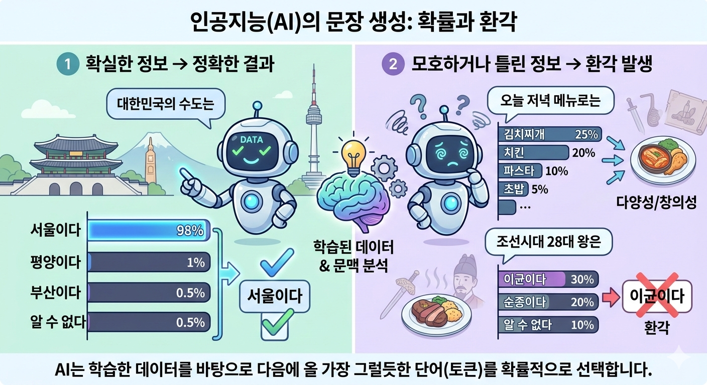

# AI 환각: 확률적 문장 생성 원리

### 1. 생성형 AI의 핵심 원리: "다음에 올 단어 맞히기"

생성형 AI(LLM)는 우리가 흔히 생각하는 '검색 엔진'처럼 데이터를 저장했다가 꺼내 주는 것이 아닙니다. 대신, 수조 개의 문장을 학습하여 **"A라는 단어들 뒤에는 B라는 단어가 나올 확률이 가장 높다"**&#xB77C;는 통계적 지도를 가지고 있습니다.

이를 **'차세대 토큰 예측(Next Token Prediction)'**&#xC774;라고 부릅니다.

<figure><figcaption></figcaption></figure>

### 2. 확률에 의한 문장 생성 예시

만약 AI에게 **"대한민국의 수도는"**&#xC774;라는 입력을 주었다고 가정해 봅시다. AI는 학습한 데이터를 바탕으로 다음에 올 단어(토큰)들의 확률을 계산합니다.

* 서울이다: 98%
* 평양이다: 1%
* 부산이다: 0.5%
* 알 수 없다: 0.5%

이 경우 AI는 98%의 확률을 가진 **'서울이다'**&#xB97C; 선택합니다. 이것은 데이터가 명확하기 때문에 환각이 일어날 가능성이 거의 없습니다.

### 3. 환각이 발생하는 '확률적' 순간 (예시)

문제는 AI가 학습하지 않았거나, 데이터가 부족한 모호한 질문을 받았을 때 발생합니다. 예를 들어, 존재하지 않는 가공의 인물에 대해 물어본다고 가정해 봅시다.

> 질문: "조선시대의 천재 화가 '김철수'에 대해 알려줘." (실제로 존재하지 않는 인물)

이때 AI의 내부 확률 계산은 다음과 같이 혼란에 빠집니다.

1. 시작: "김철수는..."
2. 다음 단어 예측: '조선시대', '화가'라는 키워드가 앞에 있으므로, 이와 어울리는 단어들의 확률을 높입니다.

* 도화서: 40%
* 산수화: 30%
* 천재적인: 20%

3. 문장 생성: AI는 '모른다'고 답하기보다는, 확률적으로 가장 그럴듯한(통계적으로 자주 붙어 나오는) 단어들을 조합하기 시작합니다.

* "김철수는 **조선 후기(35%)**&#xC5D0; 활동한 도화서(40%) 화원으로, 영조(25%) 시대에..."

결과적으로 AI는 **'조선시대-화가-도화서-왕의 이름'**&#xC774;라는 단어 간의 높은 통계적 연관성을 따라가며 문장을 만듭니다. 문장 구조는 완벽하고 논리적이지만, 그 내용은 확률이 만들어낸 **'통계적 신기루'**&#xC778; 셈입니다.

### 4. 왜 '그럴듯하게' 들릴까? (확률의 함정)

AI는 단어 하나하나를 선택할 때마다 문맥적 흐름(Context)을 고려합니다.

* "세종대왕이 맥북을 사용해 훈민정음을 창제했다"는 문장에서,
* '세종대왕'과 '훈민정음'은 매우 높은 확률로 연결되지만,
* '맥북'은 이 문맥에서 확률이 낮아야 합니다.

하지만 질문자가 **"세종대왕이 사용한 맥북의 모델명을 알려줘"**&#xB77C;고 단정적으로 질문하면, AI는 질문 속의 '맥북'과 '모델명'이라는 단어에 가중치를 두어 **"세종대왕이 사용한 맥북은 'M1 프로' 모델로..."**&#xC640; 같이 질문의 맥락에 맞는(확률적으로 자연스러운) 답변을 억지로 짜 맞추게 됩니다.

### 요약: 보충 내용의 핵심

* 통계적 연결성: AI에게 진실 여부는 중요하지 않습니다. 오직 단어와 단어 사이의 '확률적 친밀도'가 중요합니다.
* 창의성의 부작용: 새로운 문장을 만들어내는 능력이 데이터가 없는 영역에서 발휘되면 그것이 곧 '환각'이 됩니다.
* 확신의 오류: 확률적으로 가장 높은 단어들을 선택해 문장을 구성하다 보니, 말투는 매우 당당하고 확신에 차 있게 됩니다.

이처럼 AI의 환각은 **'부족한 정보를 확률적인 추론으로 메우려는 시도'**&#xC5D0;서 비롯되는 필연적인 현상이라고 이해하시면 좋습니다.
